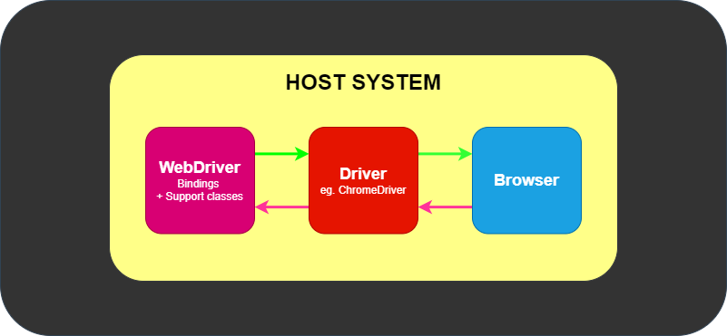
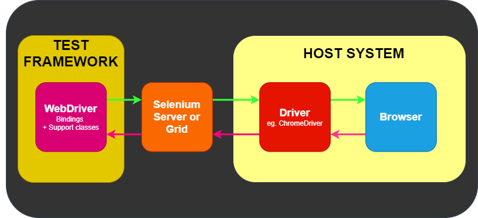

# Selenium

一、基本原理

Start driver sessions --》 Take action on browser --》 Request browser information --》 Establish Waiting Strategy --》 Find an element --》 Take action on element --》 Request element information --》 End the session

定义驱动实例 --》&#x20;


遵循标准：W3C Recommendation

二、组件

<figure><figcaption></figcaption></figure>

<figure><figcaption></figcaption></figure>

<figure><figcaption></figcaption></figure>

WebDriver 实现浏览器的 API 调用集

三、操作集

特定的浏览器功能支持，如 Chrome

```python
    options = webdriver.ChromeOptions()
    driver = webdriver.Chrome(options=options)
```

```python
    options.add_argument("--start-maximized")
```

......等等

Waits 等待

Implicit waits 隐式等待 固定时间

```python
    driver.implicitly_wait(2)
```

Explicit waits 显式等待 循环固定时间等待，直到出现。

```python
    wait = WebDriverWait(driver, timeout=2)
    wait.until(lambda d : revealed.is_displayed())
```

&#x20;

Web elements 网页元素

File Upload 提供非交互式上传文件方法

```python
    file_input = driver.find_element(By.CSS_SELECTOR, "input[type='file']")
    file_input.send_keys(upload_file)
    driver.find_element(By.ID, "file-submit").click()
```

Locator 定位元素，八种传统元素定位方式。class name、css selector、id、name、link text、partial link text、tag name、xpath。HTML 语法示例：

class name: information


```html
/<html>
<body>
<style>
.information {
  background-color: white;
  color: black;
  padding: 10px;
}
</style>
<h2>Contact Selenium</h2>

<form action="/action_page.php">
  <input type="radio" name="gender" value="m" />Male &nbsp;
  <input type="radio" name="gender" value="f" />Female <br>
  <br>
  <label for="fname">First name:</label><br>
  <input class="information" type="text" id="fname" name="fname" value="Jane"><br><br>
  <label for="lname">Last name:</label><br>
  <input class="information" type="text" id="lname" name="lname" value="Doe"><br><br>
  <label for="newsletter">Newsletter:</label>
  <input type="checkbox" name="newsletter" value="1" /><br><br>
  <input type="submit" value="Submit">
</form> 

<p>To know more about Selenium, visit the official page 
<a href ="www.selenium.dev">Selenium Official Page</a> 
</p>

</body>
</html>
```

